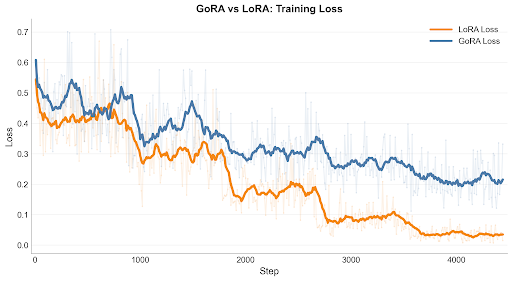
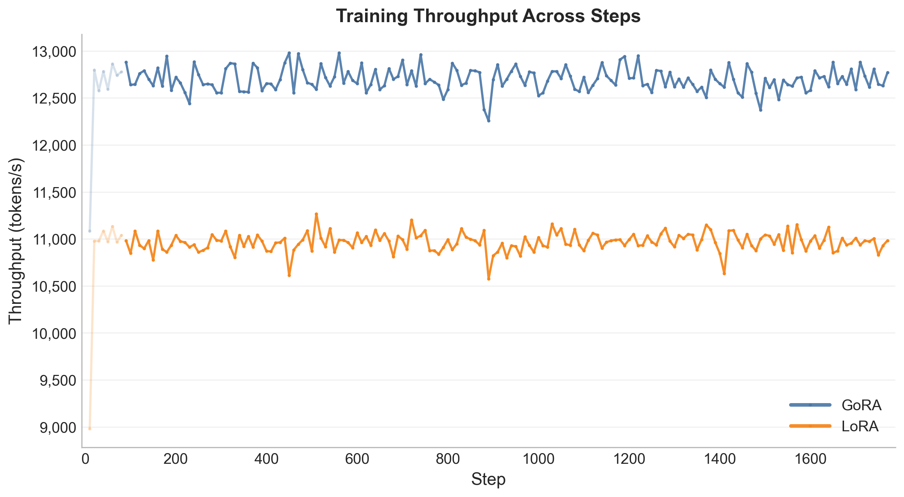
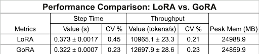
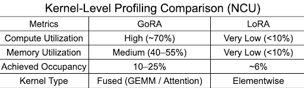
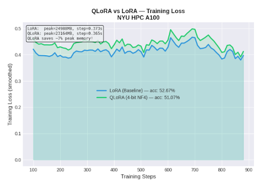
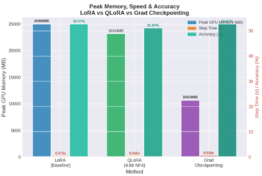
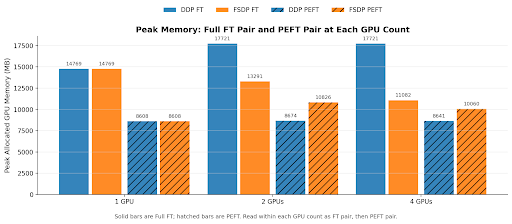
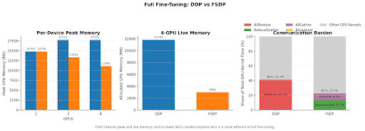
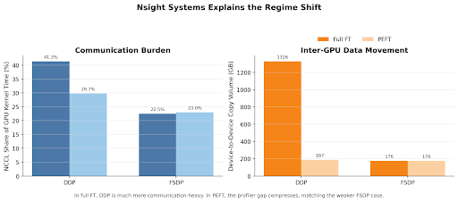

# Training Efficiency Comparisons for LLM Fine-Tuning

**Songchen Xue · Sanchit Sahay · Sruthi Raghavan**

---

## 1. Project Overview

Fine-tuning large language models (LLMs) requires significant GPU memory and compute resources, making it difficult to deploy under limited hardware constraints.

This project builds a reproducible benchmarking framework to compare multiple fine-tuning strategies under constrained environments. We focus on both system efficiency and model performance, with experiments around:

* **LoRA**
* **QLoRA (4-bit quantization)**
* **GoRA (gradient-based low-rank adaptation)**
* **Gradient Checkpointing**
* **Distributed scaling (DDP vs FSDP)**

**Dataset:** GSM8K  
**Model:** Qwen2.5-1.5B-Instruct

---

## 2. Repository Structure

```text
project-root/
├── configs/
│   ├── base.yaml
│   ├── distributed/
│   │   ├── single_gpu.yaml
│   │   ├── ddp.yaml
│   │   └── fsdp.yaml
│   ├── hub.yaml
│   └── profile.yaml
├── experiments/
│   ├── lora_benchmark.py
│   ├── qlora_benchmark.py
│   ├── gora_benchmark.py
│   ├── gradient_checkpointing_benchmark.py
│   ├── ddp_scaling.py
│   ├── fsdp_scaling.py
│   └── smoketest_benchmark.py
├── scripts/
│   ├── train.py
│   ├── eval.py
│   ├── eval_pretrained.py
│   ├── prepare_data.py
│   ├── summarizing.py
│   ├── profile_ddp.sh
│   ├── profile_fsdp.sh
│   └── run_gpu_benchmarks.sh
├── src/
│   ├── experiment_runner.py
│   ├── model.py
│   ├── peft.py
│   ├── data.py
│   ├── evaluator.py
│   ├── trainer_base.py
│   ├── trainer_single.py
│   ├── trainer_distributed.py
│   ├── distributed.py
│   ├── checkpoint.py
│   ├── metrics.py
│   ├── profiler.py
│   ├── hub.py
│   ├── prompts.py
│   └── utils.py
├── analysis
└── README.md
```

Notes:

* `experiments/` contains the main benchmark entrypoints used in this repo.
* `scripts/train.py` is a shared training setup entrypoint, but the benchmark runs are launched through `experiments/*.py`.
* `visualization/` contains plotting and log-summary utilities.

---

## 3. Setup

Install dependencies:

```bash
pip install -r requirements.txt
```

---

## 4. How to Run

### 4.1 LoRA Benchmark

```bash
python3 experiments/lora_benchmark.py
```

Dry-run:

```bash
python3 experiments/lora_benchmark.py --dry-run
```

### 4.2 QLoRA Benchmark

```bash
python3 experiments/qlora_benchmark.py
```

Dry-run:

```bash
python3 experiments/qlora_benchmark.py --dry-run
```

### 4.3 GoRA Benchmark

```bash
python3 experiments/gora_benchmark.py
```

Dry-run:

```bash
python3 experiments/gora_benchmark.py --dry-run
```

### 4.4 Gradient Checkpointing Benchmark

```bash
python3 experiments/gradient_checkpointing_benchmark.py
```

### 4.5 Smoke Test

```bash
python3 experiments/smoketest_benchmark.py
```

### 4.6 DDP Scaling

```bash
torchrun --standalone --nproc_per_node=4 experiments/ddp_scaling.py --max-steps 500
```

### 4.7 FSDP Scaling

```bash
torchrun --standalone --nproc_per_node=4 experiments/fsdp_scaling.py --max-steps 500
```

### 4.8 Profiling Wrappers

```bash
bash scripts/profile_ddp.sh 4
bash scripts/profile_fsdp.sh 4
```

### 4.9 Standalone Evaluation

Evaluate a checkpointed model:

```bash
python3 scripts/eval.py --checkpoint /path/to/checkpoint
```

Evaluate the pretrained base model:

```bash
python3 scripts/eval_pretrained.py --max-examples 100
```

### 4.10 Log Summaries and Visualization

Summarize saved evaluation metrics:

```bash
python3 scripts/summarizing.py
```

Summarize GoRA vs LoRA runtime logs:

```bash
python3 visualization/summarize_gora_lora_runtime.py
```

Plot run3/run4 loss and eval accuracy:

```bash
python3 visualization/plot_run3_run4_loss_acc.py
```

---

## 5. Outputs

Typical experiment runs write to versioned directories under:

```text
output/<experiment-name>/v###/
```

Common artifacts include:

* `config.yaml`
* `experiment.json`
* `resolved_peft_config.json` when PEFT is enabled
* `final_results.json`
* `run.log`

Visualization outputs are written under:

```text
visualization/outputs/
```

---

## 6. Figures

### 6.1 LoRA vs GoRA



This plot compares the training loss trajectories of LoRA and GoRA across the benchmark run. LoRA converges faster, while GoRA shows more stable but slower optimization.



This plot shows step-level throughput, illustrating the runtime efficiency gap between LoRA and GoRA.



This summary figure compares the overall performance characteristics of LoRA and GoRA.



This profiler-based figure highlights kernel-level differences between GoRA and LoRA.

### 6.2 QLoRA vs LoRA



This plot compares optimization behavior between QLoRA and standard LoRA.



This figure shows the GPU memory savings achieved by QLoRA relative to LoRA.

### 6.3 Distributed FT

This section groups the full fine-tuning and communication-related figures to highlight distributed training trade-offs.



This figure compares the overall efficiency trade-off between full fine-tuning and parameter-efficient fine-tuning methods.



This figure highlights the scaling and systems trade-offs between DDP and FSDP for full fine-tuning workloads.



This figure summarizes communication or memory-movement effects that help explain system-level efficiency differences.

---

## 7. Reproducibility

This project is designed around reproducible experiment execution:

* Config-driven setup
* Versioned output directories
* Structured logging
* Shared evaluation utilities
* Fixed random seeds where applicable

---

## Observations & Conclusions

- System efficiency is largely determined by GPU utilization rather than raw model performance.

- Improving utilization (e.g., via GoRA) can significantly boost throughput without increasing memory usage.

- Memory optimization depends on the bottleneck:
  - QLoRA → parameter-dominated memory
  - Gradient Checkpointing → activation-dominated memory

- Trade-offs across methods:
  - QLoRA trades accuracy for memory (with slight speedup)
  - Checkpointing trades efficiency for larger memory savings

- GoRA achieves comparable performance to LoRA while improving throughput (~15%).

- Lightweight PEFT methods enable practical fine-tuning under limited hardware constraints.

- For distributed training:
  - FSDP is preferred for full fine-tuning
  - DDP is more efficient for PEFT
